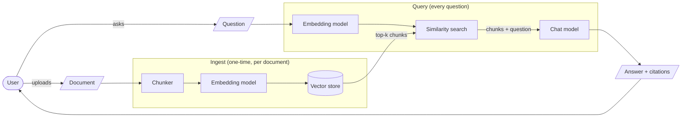
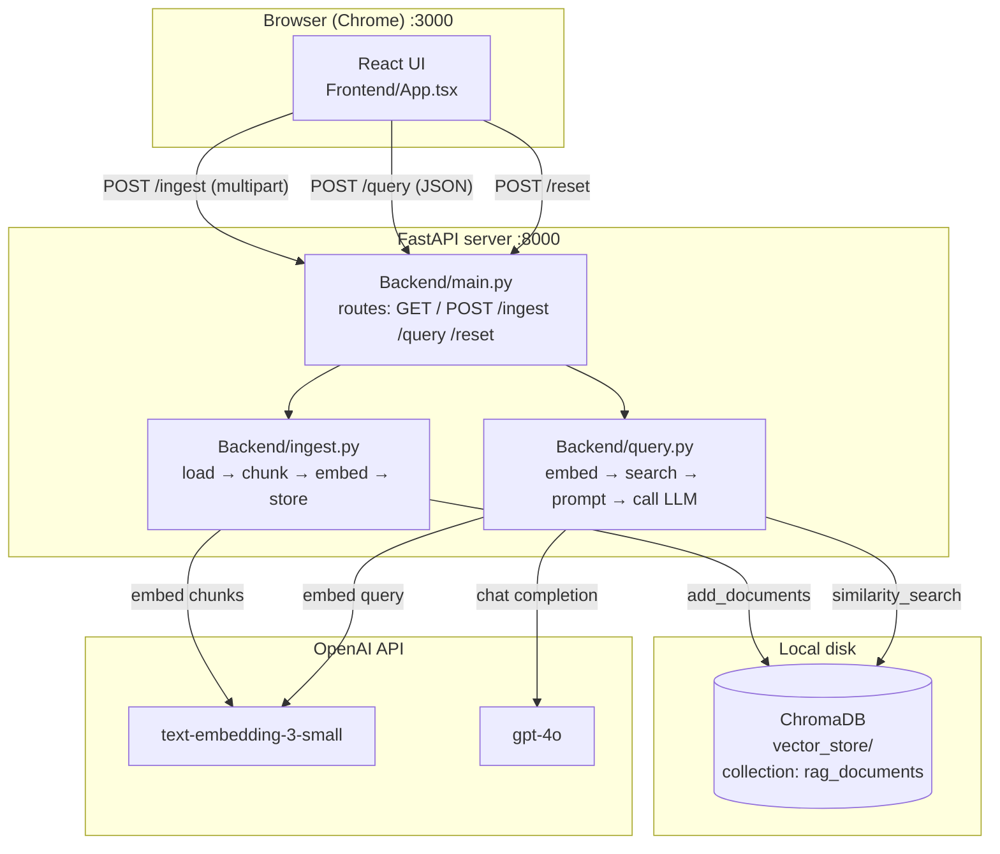
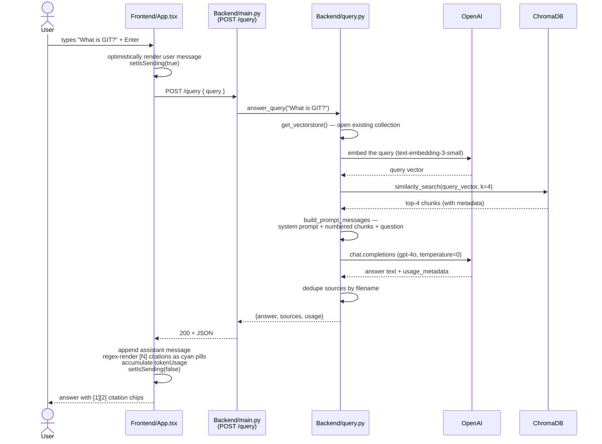
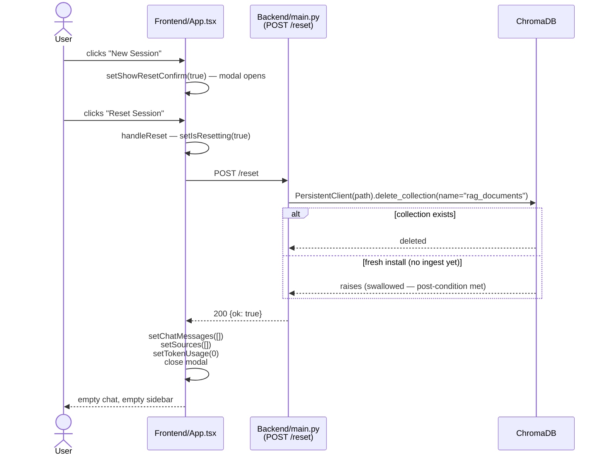
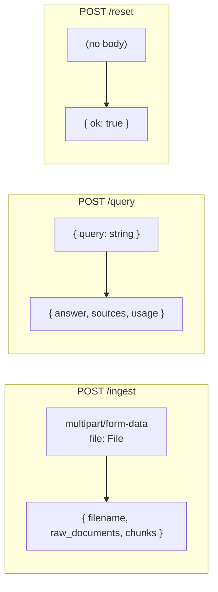

# DocWhisperer — Architecture Overview

A complete walk-through of how the codebase works: every file, every flow, and what happens when a user clicks each button. Written for someone who can read Python and TypeScript but hasn't seen this project before.

---

## 1. What DocWhisperer is, in one paragraph

DocWhisperer is a **Retrieval-Augmented Generation (RAG)** chatbot. The user uploads documents (PDF, DOCX, TXT, MD, JSON), and the system answers questions about them. Instead of giving the entire document to the language model on every question (expensive and slow, plus the doc may not even fit in the context window), it splits the document into small chunks once, converts each chunk to a vector that captures its meaning, and stores those vectors. At query time it converts the user's question into the same vector space, finds the chunks closest in meaning, and feeds *only those* chunks to the language model along with the question. The model then generates an answer grounded in retrieved text and cites which chunk each fact came from.

## 2. The RAG flow at one level of abstraction



Two paths cross at the vector store: **ingest** writes to it, **query** reads from it. Everything else flows from that.

## 3. Component diagram — what runs where



**Key boundaries:**
- The browser never talks to OpenAI directly — the backend holds the API key (loaded from `.env`).
- The backend is **mostly stateless** between requests; the only persistent state is ChromaDB on disk.
- "Session" state (chat messages, the sources-in-use panel, token counter) lives entirely in React. Hitting refresh wipes it. Clicking "New Session" wipes both the React state and the ChromaDB collection.

## 4. The codebase, file by file

| File | Lines | Role |
|---|---|---|
| `Backend/main.py` | ~135 | FastAPI app + routes. Glues the two pipelines to HTTP, handles CORS, surfaces errors to the UI. |
| `Backend/ingest.py` | ~190 | The ingest pipeline as four functions (`load_document` → `chunk_documents` → `store_chunks`) wrapped in `ingest_file`. Also has a CLI for one-off ingestion. |
| `Backend/query.py` | ~225 | The query pipeline as four functions (`get_vectorstore` → `retrieve_chunks` → `build_prompt_messages` → `generate_answer`) wrapped in `answer_query`. Also has a CLI. |
| `Frontend/App.tsx` | ~520 | The entire single-page UI: sidebar, chat area, input, file upload, "New Session" modal, sources panel, token-usage bar. |
| `Frontend/index.css` | ~55 | Brand tokens (cyan accent, dark surface), `glass-panel` and `glow-cyan` utility classes, root `font-size: 90%` for the global zoom-down. |
| `Frontend/main.tsx` | ~10 | React 19 entry point — mounts `<App />` into `#root`. |
| `Frontend/index.html` | ~12 | Document shell — `<title>DocWhisperer</title>` and the Vite script tag. |
| `Frontend/vite.config.ts` | ~25 | Vite config (port 3000, React + Tailwind plugins). |
| `requirements.txt` | ~25 | Backend Python deps (langchain stack, chromadb, fastapi, openai). |
| `Frontend/package.json` | ~35 | Frontend Node deps (React 19, Vite, Tailwind, framer-motion, lucide-react). |
| `.env.example` | small | Template — copy to `.env` and fill in `OPENAI_API_KEY`. |

## 5. Flow A — Ingesting a document

What happens when the user clicks "ADD DOCUMENT" and picks a file:

```mermaid
sequenceDiagram
    actor User
    participant UI as Frontend/App.tsx
    participant API as Backend/main.py<br/>(POST /ingest)
    participant Ingest as Backend/ingest.py
    participant OpenAI
    participant Chroma as ChromaDB
    participant FS as Disk<br/>(temp file)

    User->>UI: clicks "ADD DOCUMENT"
    UI->>UI: opens hidden &lt;input type=file&gt;
    User->>UI: picks Progress.docx
    UI->>UI: handleFileSelect — setIsUploading(true)
    UI->>API: POST /ingest (multipart)
    API->>FS: write upload to NamedTemporaryFile<br/>(suffix preserved)
    API->>Ingest: ingest_file(tmp.name, source_name="Progress.docx")
    Ingest->>FS: load_document — pick loader by suffix<br/>(PyPDFLoader / Docx2txtLoader / TextLoader / json)
    Ingest->>Ingest: chunk_documents — split into ~1000-char chunks<br/>(200-char overlap)
    Ingest->>Ingest: stamp metadata.source = "Progress.docx"<br/>on each chunk (overwrite full path)
    Ingest->>OpenAI: text-embedding-3-small<br/>(one call per chunk)
    OpenAI-->>Ingest: embedding vectors
    Ingest->>Chroma: add_documents(chunks)<br/>(creates collection on first ingest)
    Chroma-->>Ingest: ok
    Ingest-->>API: {filename, raw_documents, chunks}
    API->>FS: os.unlink(tmp.name)
    API-->>UI: 200 + summary JSON
    UI->>UI: append to sources state<br/>setIsUploading(false)
    UI-->>User: source chip appears in sidebar
```

**Why a temp file?** All three LangChain loaders want a real file path on disk. The original filename is preserved separately and threaded through `source_name` so chunk metadata cites `Progress.docx`, not `tmp42j8vvk2.docx`.

**Chunk math** (configured in `Backend/ingest.py` lines 47–48):
- `CHUNK_SIZE = 1000` characters, `CHUNK_OVERLAP = 200`. The recursive splitter prefers paragraph and sentence boundaries before falling back to character splits.
- For PDFs, `PyPDFLoader` returns one Document per page; if a page is already shorter than 1000 chars (typical for slide decks), it stays as one chunk.

## 6. Flow B — Asking a question

What happens when the user types a question and hits Enter:



**The grounding contract** (system prompt in `Backend/query.py` lines 51–57):
- "Answer using ONLY the provided context."
- "If the answer cannot be found, respond exactly: 'I don't know based on the provided documents.'"
- "When you state a fact, mention which numbered source it came from."

This is what stops the model from hallucinating outside the documents and is why empty-store queries get a polite "no documents have been ingested yet" message instead of made-up content.

**The `[N]` citations** point at the *chunk* with that index in the retrieved set, not at the *source file*. So `[1]` and `[2]` from a single-doc upload mean "two different sections of that doc." See `Frontend/App.tsx` lines 286–298 for the regex that converts inline `[1]` markers into the cyan pills.

## 7. Flow C — Resetting the session

What happens when the user clicks "New Session" and confirms:



**Why `delete_collection()` and not `rm -rf vector_store/`?** Chroma keeps a SQLite handle open for the lifetime of the uvicorn process. On Windows, deleting that file on disk while it's open fails with a file lock. `delete_collection()` is the supported API and it's atomic. The `vector_store/` directory itself stays intact; the next `/ingest` lazily re-creates the collection inside it.

## 8. State map — what lives where

| State | Where | Persists across…? |
|---|---|---|
| Chat messages | React (`chatMessages` in `App.tsx`) | Tab open. Wiped on refresh, on "New Session", on closing the tab. |
| Sources in sidebar | React (`sources`) | Same as above. |
| Token-usage counter | React (`tokenUsage`) | Same as above. Resets to 0 on reset. |
| Modal/loading flags | React (transient `useState`) | In-memory only. |
| Chunks + embeddings | ChromaDB (`vector_store/`) | Server restarts. Wiped only by `/reset` or manual `rm -rf vector_store/`. |
| OpenAI API key | `.env` file | Forever (until you edit it). |

The frontend is intentionally optimistic: on `/query` failure, the user message stays in chat (so they can see what they asked) but the assistant's reply never arrives — instead a red error banner explains why. Same pattern for `/ingest` and `/reset`.

## 9. Configuration knobs (where to change behavior)

| Constant | Default | File:line | Effect |
|---|---|---|---|
| `CHUNK_SIZE` | 1000 chars | `Backend/ingest.py:47` | Larger = more context per chunk, fewer chunks, more tokens per query. |
| `CHUNK_OVERLAP` | 200 chars | `Backend/ingest.py:48` | Higher overlap reduces "answer split across two chunks" misses but inflates store size. |
| `EMBEDDING_MODEL` | `text-embedding-3-small` | `Backend/ingest.py:53`, `Backend/query.py:35` | **Must match in both files.** Bump to `-3-large` if recall is poor. |
| `COLLECTION_NAME` | `rag_documents` | same | **Must match in both files.** Identifier inside ChromaDB. |
| `CHAT_MODEL` | `gpt-4o` | `Backend/query.py:39` | Swap to `gpt-4o-mini` to cut cost ~15× during dev. |
| `TOP_K` | 4 | `Backend/query.py:43` | More chunks per answer = better recall, more tokens, higher cost. |
| `TEMPERATURE` | 0 | `Backend/query.py:46` | 0 = deterministic answers; bump for varied phrasing. |
| `SYSTEM_PROMPT` | grounded RAG instructions | `Backend/query.py:51–57` | Where you'd add tone, persona, or extra constraints. |
| Soft token-usage cap | 100,000 | `Frontend/App.tsx` (token bar) | Visual only — does not enforce a real limit. |

## 10. API contract (what the frontend and backend agree on)



**Error envelope** (FastAPI default): `{"detail": "..."}` with HTTP 4xx/5xx.
- 400 — unsupported file type, malformed JSON
- 500 — `OPENAI_API_KEY` missing, OpenAI quota exceeded, anything else unexpected

The frontend renders all errors uniformly in a red banner above the input box; clicking the banner dismisses it.

## 11. External dependencies and their role

| Library | Where used | Why |
|---|---|---|
| `fastapi` | `Backend/main.py` | HTTP routes, request validation, OpenAPI docs at `/docs`. |
| `langchain-community` | `Backend/ingest.py` | Loaders: `PyPDFLoader`, `Docx2txtLoader`, `TextLoader`. |
| `langchain-text-splitters` | `Backend/ingest.py` | `RecursiveCharacterTextSplitter`. |
| `langchain-openai` | both backend modules | Wraps the OpenAI SDK for embeddings and chat with a uniform interface. |
| `langchain-chroma` | both backend modules | Wraps `chromadb` so the same `Chroma(...)` object can both write (ingest) and read (query). |
| `chromadb` | `Backend/main.py` | Direct usage **only for `/reset`** (`PersistentClient.delete_collection`). |
| `python-dotenv` | `Backend/main.py` | Loads `.env` at startup so `OPENAI_API_KEY` is in `os.environ`. |
| `react`, `react-dom` | `Frontend/main.tsx`, `App.tsx` | UI framework. |
| `framer-motion` (`motion/react`) | `App.tsx` | Modal fade/scale, sidebar collapse, message entry. |
| `lucide-react` | `App.tsx` | Icon set (Send, UploadCloud, Plus, etc.). |
| `tailwindcss` (v4 via `@tailwindcss/vite`) | `App.tsx`, `index.css` | Utility-first styling. |

## 12. Running the system locally

```powershell
# One-time setup
py -3.14 -m venv .venv
.\.venv\Scripts\Activate.ps1
pip install -r requirements.txt
copy .env.example .env       # then put your OPENAI_API_KEY in .env

cd Frontend
npm install
cd ..

# Two terminals from here on:

# Terminal 1 — backend
.\.venv\Scripts\python.exe -m uvicorn Backend.main:app --reload --port 8000

# Terminal 2 — frontend
cd Frontend
npm run dev    # serves http://localhost:3000
```

Open http://localhost:3000 in Chrome.

## 13. Where to look first if something breaks

| Symptom | First place to look |
|---|---|
| "ADD DOCUMENT" does nothing in the browser | Browser DevTools console + the uvicorn log. The button is wired in `App.tsx:handleFileSelect`. |
| Upload returns 500 | uvicorn log shows the real error. Most common: `OPENAI_API_KEY is not set` or OpenAI 429 (`insufficient_quota`). |
| Citations show `tmp42j…docx` instead of the real filename | `Backend/ingest.py:load_document` — `source_name` should override `path.name`. |
| `[2]` exists but only one doc was uploaded | Expected — `[N]` indexes chunks, not files. See section 6. |
| "New Session" doesn't clear the backend | `POST /reset` in `Backend/main.py`; check uvicorn log for the `[api] /reset received` line. |
| Token bar stuck at 0 | `Backend/query.py:generate_answer` — `usage_metadata` may be empty if the LLM provider didn't return it. |

---

That's the whole system. The two backend modules (`ingest.py`, `query.py`) are intentionally small and single-purpose so each one is easy to read top-to-bottom; `main.py` is just the HTTP shell that connects them; `App.tsx` is the entire frontend in one file.
